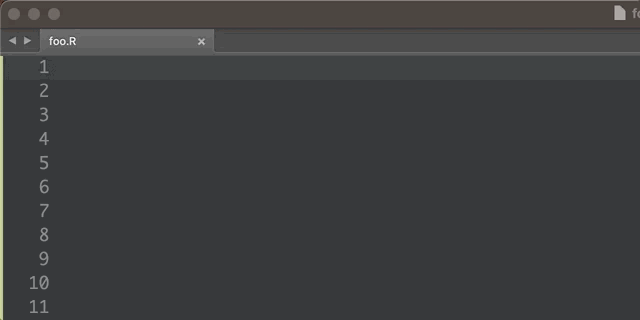
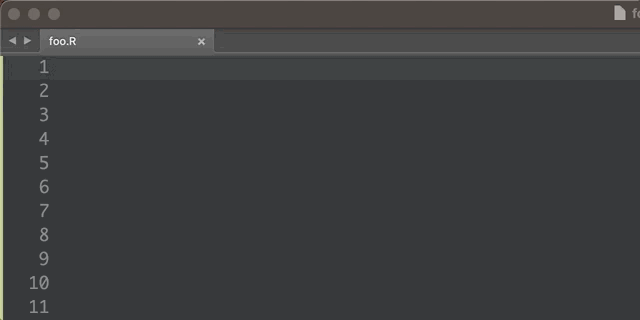

```{r setup, include=FALSE}
knitr::opts_chunk$set(
  warning = FALSE,
  message = FALSE,
  fig.path = "figs/",
  fig.width = 7.252,
  fig.height = 4,
  comment = "#>",
  fig.retina = 3,
  R.options = list(width = 60)
)

library(tidyverse)
library(knitr)
```

<center>

</center>

I recently discovered a wonderfully useful little program called [espanso](https://espanso.org/) -- a "text expander" that I now use on a daily basis. Text expander programs "expand" short text "triggers" into longer / more complex strings of text, like this:

<center>

</center>

There are lots of these programs out there, such as [Typinator](https://www.ergonis.com/products/typinator/), or the creatively-named "[textexpander](https://textexpander.com/)" (macOS even has a [build-in expander](https://www.goodmanconsulting.com/hottips/2018/1/31/speed-up-mac-and-ios-typing-with-text-expansion)). But I prefer to use open source software whenever possible (the espanso [source code](https://github.com/federico-terzi/espanso) is on GitHub), and especially when using software that tracks the text you type (imagine how easy it would be to grab passwords with this type of software). Plus espanso is free 😄. Of course if you'd like to support the project you can donate [here](https://espanso.org/sponsors/).

More than anything, I started (and kept) using espanso because I found it to be remarkably simple to use and easy to customize. So far, it has integrated quite nicely into my day-to-day workflow. In fact, I have become such a fan of espanso that I decided to sit down and write a whole post highlighting some of the ways I use it.

# Quick overview

> **Note**: I'm skipping a lot of details about installation, etc. because it's all there in the espanso [documentation](https://espanso.org/docs/). It's really simple to get it up and running -- check it out.

To set a text expansion, all you have to do is edit the `default.yml` file. You can find it's location with this in the terminal:

```{r, eval=FALSE}
espanso path
```
```
/Users/jhelvy/Library/Preferences/espanso
```

Once you've opened up the `default.yml` file, you can define an expansion like this:

```{r, eval=FALSE}
  # Simple text replacement
  - trigger: ":test"
    replace: "Hello World!"
```

Now anytime I type `:test`, the text will expand to `Hello World!`. Pretty cool! 😎

What I really love about this interface is it's simplicity. With just a few lines you can define a wide range of custom expansions. After using it for just a few weeks, I have already come up with several dozen expansions that I now regularly use.

I'll spend the rest of this post highlighting a few use cases, but for reference I also included a copy of *most* of my settings at the [end of this post](#highlights-from-my-default.yml-file) (I took out some snippets with personal information like the link to my personal Zoom room, etc.)

# Personal information

I can't stand having to type my name, address, email, etc. into online forms. I probably have to do this once a week or so for one reason or another, so coming up with some quick expansions for common personal information is extremely satisfying.

> **Note**: It's probably a really bad idea to put passwords you use in your espanso settings, so don't do that!

Here are a few I've set up:

<center>

</center>

```{r, echo=FALSE}
read_csv(here::here(
    "_posts", "2021-05-04-expand-your-productivity-with-espanso",
    "expansions.csv")) %>%
    kable()
```

# URLs

I used to rely on bookmarks for lots of common sites I visit, but I often need to copy-paste the actual url to those sites (e.g. if I'm sending the link to someone else). Before, I had to open up my browser, navigate to the site, then copy the url. Now I can just type a few keys 🎉! I start each of these with `"//"`. For example, to get to my GitHub page, I just type `//gh`:

<center>

</center>

By far my most used url expansion this year was `//zoom` to expand to the url to my personal zoom room! 🚀

# Code

This is where things start getting _really_ helpful. I write lots of common code snippets for a wide variety of use cases, and the ability to automate these _globally_ (i.e. not just in a code IDE) on my computer is an incredible help. The time savings don't come from avoiding the extra keystrokes -- they come from avoiding _typos_! It's all too easy to miss a tiny symbol or letter in a chunk of code which then results in several minutes (if not longer) of searching for the bug.

As a convention, I decided to start all of my "code" triggers with a double letter of the first letter of the code language. So html expansions all start with `hh`, R expansions start with `rr`, python with `pp`, etc. I use this rather than starting with the default `:` symbol because 1) I find it easier to remember, and 2) it doesn't require me to use the Shift key (so it's fast).

## HTML

I don't write a lot of html, but occasionally I'll use it to insert an image in a RMarkdown document. And usually I want that image centered. The basic template I usually start with is:

```{html, eval=FALSE}
<center>

</center>
```

I use the trigger `hhimg` (which I remember as "html" + "img") to insert this snippet. Here's the code to define this expansion:

```{r eval=FALSE}
  - trigger: "hhimg"
    replace: "<center>\n\n</center>"
```

Notice the `$|$` symbols inside the quotes following "src". This sets the location of the cursor once the expansion is complete, allowing me to quickly type in the name of the path to the image I want to insert. Another one of those little bonus features about espanso that is just 🤌 \*chef's kiss\*.

## R

Since I use R more than any other language, I've come up with a lot of R-specific shortcuts. But before I dive into them, a quick side note:

One important modification I learned (thanks to some [help](https://www.reddit.com/r/espanso/comments/n3wigg/snippets_only_partially_expand_in_rstudio/) on the [espanso Reddit community](https://www.reddit.com/r/espanso/)) is that if you're working in RStudio, the expansions don't quite work correctly on their own (I believe it might have something to do with RStudio's autofill feature). To fix it, I had to insert the `force_clipboard: true` setting into **each** espanso expansion. For example, in my snippet to read in a CSV file, I inserted this option between the trigger and expansion text like this:

```{r eval=FALSE}
  - trigger: "rrcsv"
    force_clipboard: true
    replace: "read_csv($|$)"
```

Okay with that in mind, I'll highlight a few R expansions I use a lot. I've organized this based on my common workflow for exploring data:

- Add a setup chunk (if working in Rmd)
- Load libraries & data
- Wrangle data
- Visualize

### Add a setup chunk

I usually include a "setup" chunk in most of my Rmd files, but it's really hard to remember all the specific details for various settings, so I made a dedicated expansion just for this. With this expansion, I can insert my whole default setup chunk with `rrsetup`:

````markdown
  - trigger: "rrsetup"
    force_clipboard: true
    replace: |
              `r ''````{r setup, include=FALSE}
              knitr::opts_chunk$set(
                warning = FALSE,
                message = FALSE,
                fig.path = "figs/",
                fig.width = 7.252,
                fig.height = 4,
                comment = "#>",
                fig.retina = 3
              )
              ```
````

### Load libraries & data

<center>

</center>

I use some simple shortcuts to load individual libraries, like `rrtidy` to expand to `library(tidyverse)`. But (as shown in the above image) I also set up an expansion to load some of my most often used libraries and settings. By typing `rrstart`, I get this expansion:

```{r eval=FALSE}
library(tidyverse)
library(cowplot)
options(dplyr.width = Inf)
```

With my libraries loaded, I then read in my data. I use `rrcsv` to expand to `read_csv($|$)`, `rrex` to expand to `read_excel($|$)`, and `rrhere` to expand to `here::here($|$)`, which I use to define paths to files.

> **Side note**: if you don't already, you should definitely try [using the {here} package to define paths](https://malco.io/2018/11/05/why-should-i-use-the-here-package-when-i-m-already-using-projects/#:~:text=The%20here%20package%20bottles%20up,needing%20to%20think%20about%20it.).

### Wrangle data

<center>

</center>

I usually wrangle my data using tidyverse commands, and I have come up with a few expansions for some common "pipelines". For example, one common sequence is to do grouped summary operations. I use the `rrgs` ("gs" for "grouped summary") trigger to load the code block:

```{r, eval=FALSE}
    group_by() %>%
    summarise()
```

Likewise, I use the `rrgm` trigger to load the code block for a grouped mutate:

```{r, eval=FALSE}
    group_by() %>%
    mutate()
```

There are so many of these you could put together!

### Visualize

<center>

</center>

Since {ggplot2} has such a distinct syntax, I decided to start my ggplot code snippets with `gg` rather than `rr`. Some of my favoriate {ggplot2} expansions are the scaling shortcuts:

- `ggsxc` --> `scale_x_continuous()`
- `ggsyc` --> `scale_y_continuous()`
- `ggsxd` --> `scale_x_discrete()`
- `ggsyd` --> `scale_y_discrete()`

I also use some snippets for common geoms, like `ggpoint`:

```{r, eval=FALSE}
ggplot() +
    geom_point(aes(x = , y = ))
```

and `ggcol`:

```{r, eval=FALSE}
ggplot() +
    geom_col(aes(x = , y = , fill = ))
```

# Paste clipboard contents as plain text

<center>

</center>

This is probably my favorite little hack. Often times, I want to copy-paste a snippet of text from one source to another, but when I go to paste it somewhere else, it retains all of the text formatting from the original source. My previous work around was to paste it first into a text editor (e.g. Sublime Text), then re-copy-paste it from there with the formatting now stripped away. But since espanso has support for working with your "clipboard", I found I could simply paste the plain text by using the `force_clipboard: true`. I use `ppp` as the trigger for this:

```{r, eval=FALSE}
  - trigger: "ppp"
    force_clipboard: true
    replace: "{{clipboard}}"
    vars:
      - name: "clipboard"
        type: "clipboard"
```

# Open things

You can run terminal commands using an espanso trigger. I haven't found too many ways to use this feature, but it is helpful for opening files or folders that may be buried deep down in some folder structure. For example, I use the `:espanso` trigger to open the `default.yml` file to edit my espanso settings:

```{r, eval=FALSE}
  - trigger: ":espanso"
    replace: "{{output}}"
    vars:
      - name: output
        type: shell
        params:
          cmd: "open '/Users/jhelvy/gh/espanso/espanso/default.yml'"
```

# Dates

These come from the espanso documentation, but they're super useful:

```{r eval=FALSE}
  - trigger: ":date"
    force_clipboard: true
    replace: "{{today}}"
    vars:
      - name: today
        type: date
        params:
          format: "%Y-%m-%d"

  - trigger: ":time"
    force_clipboard: true
    replace: "{{time}}"
    vars:
      - name: time
        type: date
        params:
          format: "%H:%M"
```

# Packages

There are already a lot of great espanso [packages](https://hub.espanso.org/). My favorite so far is the [emoji package](https://hub.espanso.org/packages/all-emojis/). It's super convenient, but I often forget the name of specific emojis, so I made another expansion to the url to an emoji cheat sheet site:

```{r, eval=FALSE}
  - trigger: "//emo"
    force_clipboard: true
    replace: "https://www.webfx.com/tools/emoji-cheat-sheet/"
```

# Highlights from my `default.yml` file

Thanks for reading, and I hope you check out [espanso](https://espanso.org/)! Here are some of the expansions I have come up with in my `default.yml` file (for now...again, I removed a few that had some personal information)


````markdown
# espanso configuration file

# This is the default configuration file, change it as you like it
# You can refer to the official documentation:
# https://espanso.org/docs/

# Matches are the substitution rules, when you type the "trigger" string
# it gets replaced by the "replace" string.

matches:

  # Sign offs

  - trigger: "cjo"
    force_clipboard: true
    replace: "Cheers,\nJohn"

  - trigger: "bjo"
    force_clipboard: true
    replace: "Best,\nJohn"

  - trigger: "rjo"
    force_clipboard: true
    replace: "Regards,\nJohn"

  - trigger: "cjp"
    force_clipboard: true
    replace: "Cheers,\nJP"

  - trigger: "cpr"
    force_clipboard: true
    replace: "Cheers,\nProfessor Helveston"

  # URLs

  - trigger: "//emo"
    force_clipboard: true
    replace: "https://www.webfx.com/tools/emoji-cheat-sheet/"

  - trigger: "//dr"
    force_clipboard: true
    replace: "https://drive.google.com/drive/u/0/my-drive"

  - trigger: "//gh"
    force_clipboard: true
    replace: "https://github.com/jhelvy/"

  - trigger: "//jh"
    force_clipboard: true
    replace: "https://jhelvy.com/"

  - trigger: "//talks"
    force_clipboard: true
    replace: "https://jhelvy.com/talks"

  - trigger: "//pubs"
    force_clipboard: true
    replace: "https://jhelvy.com/publications"

  - trigger: "//gm"
    force_clipboard: true
    replace: "https://mail.google.com/mail/u/0/"

  # GW

  - trigger: ":title"
    force_clipboard: true
    replace: "Assistant Professor"

  - trigger: ":gw"
    force_clipboard: true
    replace: "George Washington University"

  - trigger: ":dept"
    force_clipboard: true
    replace: "Engineering Management and Systems Engineering"

  # Names

  - trigger: ":jp"
    force_clipboard: true
    replace: "John Paul Helveston"

  - trigger: ":jh"
    force_clipboard: true
    replace: "John Helveston"

  # HTML

  - trigger: "hhimg"
    force_clipboard: true
    replace: "<center>\n\n</center>"

  - trigger: "hhcss"
    force_clipboard: true
    replace: "<style>\n$|$\n</style>"

  - trigger: "hhbr"
    force_clipboard: true
    replace: "<br>"

  # R

  - trigger: "rrrm"
    force_clipboard: true
    replace: "rm(list = ls())"

  - trigger: "rrrs"
    force_clipboard: true
    replace: "rs.restartR()"

  - trigger: "rrlib"
    force_clipboard: true
    replace: "library($|$)"

  - trigger: "rrtidy"
    force_clipboard: true
    replace: "library(tidyverse)\n"

  - trigger: "rrdply"
    force_clipboard: true
    replace: "library(dplyr)\n"

  - trigger: "rrcow"
    force_clipboard: true
    replace: "library(cowplot)\n"

  - trigger: "rrops"
    force_clipboard: true
    replace: "options(dplyr.width = Inf)\n"

  - trigger: "rrstart"
    force_clipboard: true
    replace: "library(tidyverse)\nlibrary(cowplot)\noptions(dplyr.width = Inf)\n"

  - trigger: "rrsetup"
    force_clipboard: true
    replace: |
              `r ''````{r setup, include=FALSE}
              knitr::opts_chunk$set(
                warning = FALSE,
                message = FALSE,
                fig.path = "figs/",
                fig.width = 7.252,
                fig.height = 4,
                comment = "#>",
                fig.retina = 3
              )
              ```

  - trigger: "rrcsv"
    force_clipboard: true
    replace: "read_csv($|$)"

  - trigger: "rrex"
    force_clipboard: true
    replace: "read_excel($|$)"

  - trigger: "rrhere"
    force_clipboard: true
    replace: "here::here($|$)"

  - trigger: "rread"
    force_clipboard: true
    replace: "read_csv(here::here($|$))"

  - trigger: "rrgs"
    force_clipboard: true
    replace: "group_by($|$) %>%\n    summarise()\n"

  - trigger: "rrgm"
    force_clipboard: true
    replace: "group_by($|$) %>%\n    mutate()\n"

  - trigger: "filterne"
    force_clipboard: true
    replace: "filter($|$ != )"

  - trigger: "rrin"
    force_clipboard: true
    replace: " %in% "

  - trigger: "ggsxc"
    force_clipboard: true
    replace: "scale_x_continuous($|$) +"

  - trigger: "ggsyc"
    force_clipboard: true
    replace: "scale_y_continuous($|$) +"

  - trigger: "ggsxd"
    force_clipboard: true
    replace: "scale_x_discrete($|$) +"

  - trigger: "ggsyc"
    force_clipboard: true
    replace: "scale_y_discrete($|$) +"

  - trigger: "ggex"
    force_clipboard: true
    replace: "expand = expansion(mult = c(0, 0.05))"

  - trigger: "rrch"
    force_clipboard: true
    replace: "```{r$|$}\n```"

  - trigger: "rrmd"
    force_clipboard: true
    replace: "rmarkdown::render($|$)"

  - trigger: "rrxi"
    force_clipboard: true
    replace: "xaringan::inf_mr()"

  - trigger: "rrgg"
    force_clipboard: true
    replace: "ggplot($|$) +\n"

  - trigger: "ggcol"
    force_clipboard: true
    replace: "ggplot() +\n    geom_col(aes(x = $|$, y = , fill = ))\n"

  - trigger: "ggpoint"
    force_clipboard: true
    replace: "ggplot() +\n    geom_point(aes(x = $|$, y = ))\n"

  # Dates

  - trigger: ":date"
    force_clipboard: true
    replace: "{{today}}"
    vars:
      - name: today
        type: date
        params:
          format: "%Y-%m-%d"

  - trigger: ":time"
    force_clipboard: true
    replace: "{{time}}"
    vars:
      - name: time
        type: date
        params:
          format: "%H:%M"

  # Paste clipboard contents as plain text

  - trigger: "ppp"
    force_clipboard: true
    replace: "{{clipboard}}"
    vars:
      - name: "clipboard"
        type: "clipboard"

  # Open things

  - trigger: ":espanso"
    replace: "{{output}}"
    vars:
      - name: output
        type: shell
        params:
          cmd: "open '/Users/jhelvy/gh/espanso/espanso/default.yml'"
````
