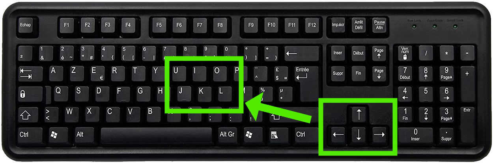
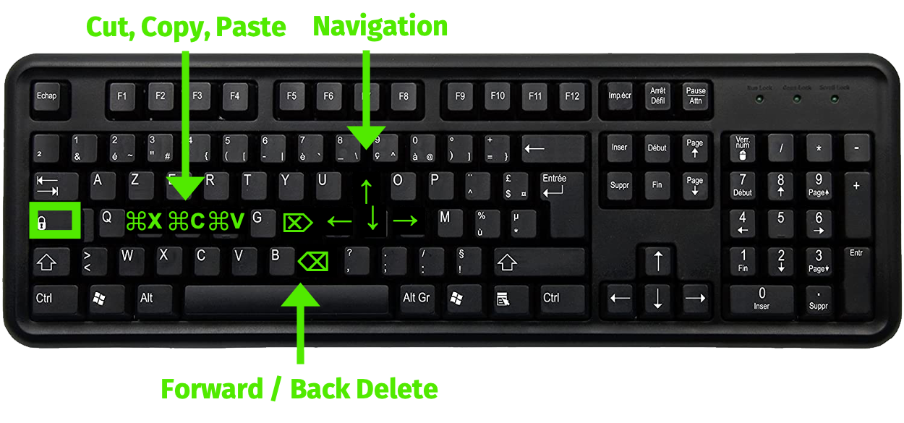
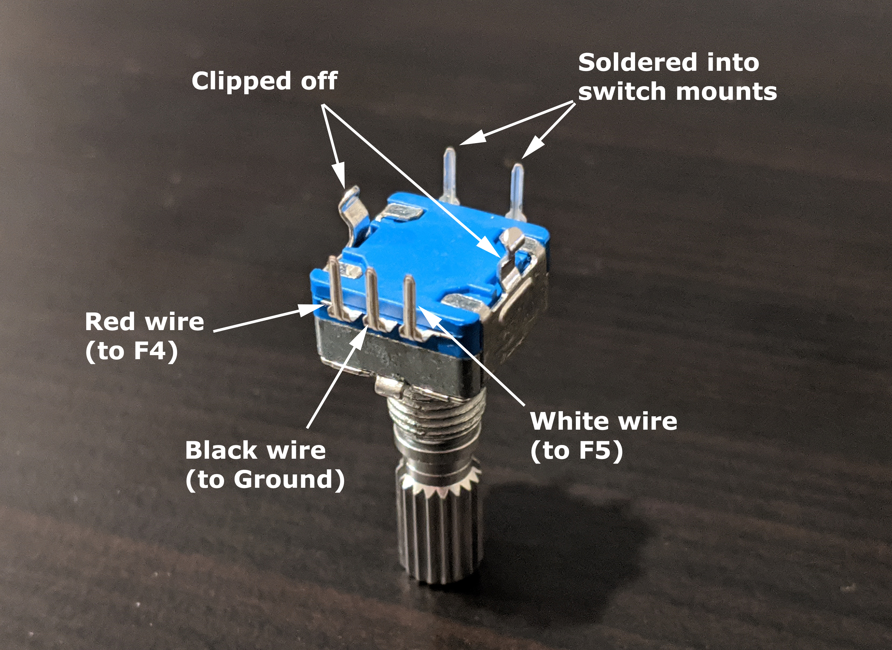

```{r setup, include=FALSE}
knitr::opts_chunk$set(echo = FALSE)
library(dplyr)
```

When I entered grad school, I started spending far more time typing on a computer than I had before. After a few months in, I started searching for a better typing experience and ways to reduce the amount of keystrokes needed to get the job done. Now a decade later, I have most definitely taken the red pill and become far more aware of solutions and technologies I never would have imagined back then. This post is a brief summary of my journey in search of keyboard nirvana.

```{r red-pill, fig.cap="Me back in 2011 reading about mechanical keyboards.", out.width="700", fig.align='center'}
knitr::include_graphics("images/red_pill.gif")
```

# Mechanical keyboards

One of my first roommates in graduate school was a remarkably fast typist and used this loud, clacky [mechanical keyboard](https://mechanicalkeyboards.com/define_mechanical_keyboard.php) (I had to wear earplugs or listen to music to get anything done when he was typing). Curiosity got the best of me, and after trying out his keyboard for a few minutes I immediately understood why people use mechanical keyboards. There is something about the combination of aural and tactile feedback you get when typing on a keyboard with [mechanical switches](https://en.wikipedia.org/wiki/Keyboard_technology#Mechanical-switch_keyboard) that makes the typing experience just...[better](https://www.businessinsider.com/what-is-a-mechanical-keyboard). But it wasn't just aesthetically better - I was able to type at a faster speed and with fewer errors when using a mechanical keyboard.

Needless to say, I immediately started searching for a mechanical keyboard to replace my crummy old [Apple keyboard](https://www.apple.com/shop/product/MLA22LL/A/magic-keyboard-us-english). Somewhere along my searching, I came across articles about people who "re-mapped" their keyboards so that some key presses would trigger other events. This seemed like a powerful idea for reducing key strokes, and after a bit more searching I discovered [Karabiner Elements](https://karabiner-elements.pqrs.org/) for mac. This software is invaluable. I made loads of customizations to simplify common operations. I became so dependent on it that I decided to design a custom key cap set for my first mechanical keyboard from [WASD Keyboards](https://www.wasdkeyboards.com/) to match my [Karabiner Elements settings](https://github.com/jhelvy/jkeyboard)

```{r jkeyboard, fig.cap="A rendering of my first custom mechanical keyboard, from WASD Keyboards.", out.width="700", fig.align='center'}
knitr::include_graphics("images/jkeyboard.png")
```

# Remapping your keyboard 

There are many software options for customizing and re-mapping your keyboard. I use Karabiner Elements for mac, but [AutoHotkey](https://www.autohotkey.com/) is probably the most popular option for Windows users. 

The use cases for these programs are endless, but I want to highlight one very powerful idea: **adding keyboard layers**. Every keyboard has at least two layers: the normal layer, and the "shift" layer that converts lower-case letters to upper-case and numbers to symbols. Unfortunately, some of the most useful keys (e.g. navigation arrows) are not conveniently located and require you to move your hand every time you want to use them. So one of the first things I implemented in re-mapping my keyboard was to try and move those navigation arrows back to "home row":

```{r nav-arrows, fig.cap="Where I wanted to relocate the navigation arrows.", out.width="700", fig.align='center'}

```

My solution was to introduce a "Capslock" layer. This layer works just like the shift layer, except it gets triggered when holding down the otherwise rarely-used Capslock key. This layer uses <kbd>J</kbd> / <kbd>I</kbd> / <kbd>K</kbd> / <kbd>L</kbd> as arrow keys for navigating the cursor selecting text, and it re-maps the <kbd>S</kbd> / <kbd>D</kbd> / <kbd>F</kbd> keys into `cut`, `copy`, and `paste` as well as <kbd>N</kbd> and <kbd>H</kbd> into `backspace` and `delete`:

```{r capslock-layer, fig.cap="My capslock layer.", out.width="700", fig.align='center'}

```

As you can see in the demo below, this modification enables me to navigate the cursor and edit code / text without ever having to leave home row:

<center>
<video width="700" controls>
  <source src="images/keyboard_nav_demo.mp4" type="video/mp4">
  <source src="images/keyboard_nav_demo.mp4" type="video/ogg">
  Your browser does not support HTML video.
</video>
</center>

I use Karabiner Elements for lots of other things too, like:

- Launching applications like `Google Chrome` or `Terminal` with a single hotkey.
- Opening `Google Chrome` to a webpage (e.g. gmail) with a single hotkey.
- Typing my email send off (`"Cheers,\nJP"`) with a single hotkey.

You can see all of my Karabiner Elements settings [here](https://github.com/jhelvy/jkeyboard).

# Towards better ergonomics with split keyboards

Typical keyboard layouts are not that ergonomic, and after several years of using my WASD keyboard I eventually started developing wrist pain. My specific pain was from prolonged [ulnar deviation](http://www.ergopedia.ca/risk_factors/Ulnar_Deviation_When_Using_the_Keyboard.html), where the hands are bent outward at the wrist joint. So I started searching for a split keyboard to be able to hold my hands at a more natural position while typing (split keyboards actually [fix a lot of ergonomic problems](https://kinesis-ergo.com/solutions/keyboard-risk-factors/)). 

```{r drake-ulnar, fig.cap="Split keyboards fix a lot of ergonomic problems, like ulnar deviation.", out.width="600", fig.align='center'}
knitr::include_graphics("images/drake_ergo_ulnar.png")
```

After doing a lot of research on different split boards, I decided to try out the [Ergodox EZ](https://ergodox-ez.com/), a [highly-rated](https://www.youtube.com/watch?v=LALQsqZP1nA&t=1s) (albeit quite expensive) keyboard. I chose the Ergodox EZ as it had a 30-day return policy (though you have to pay the return shipping), and because the company that makes the Ergodox (ZSA) has some of the most highly-rated customer service of any company ever. I figured if I didn't like it, I could probably return it without too much hassle.

```{r ergodox, fig.cap="The Ergodox EZ.", out.width="700", fig.align='center'}
knitr::include_graphics("images/ergodox.png")
```

One of the other features that attracted me to the Ergodox is their [Oryx](https://ergodox-ez.com/pages/oryx) configurator software. This is an in-browser web application that enables you to fully customize every single key on the keyboard through a very user-friendly UI. All of a sudden, many of the key features that I loved about Karabiner Elements (such as re-mapping my Capslock key to use navigation arrows on the home row) could be programmed directly into the keyboard itself. This meant I could use the keyboard on any computer and have the same re-mapped keys at the ready.

```{r oryx, fig.cap="Screenshot of the Oryx software.", out.width="700", fig.align='center'}
knitr::include_graphics("images/oryx.jpg")
```

There are a lot of things to like about the Ergodox. First, the Oryx software was a game changer. Being able to directly control what each key does gave me all sorts of new ideas that made my typing incredibly efficient and far more comfortable than anything I had used in the past. But the single biggest improvement was probably the **thumb key cluster**. Your thumbs are quite strong, but on most keyboards they're only useful for the space bar and maybe some contorted use of modifier keys. In contrast, the Ergodox has several keys right under each thumb, enabling far more efficient and comfortable access to using your thumb to type. 

My single biggest improvement in using the thumb keys was to swap what used to be my capslock layer trigger to a thumb key. Now instead of holding down the capslock key with my much weaker left pinky finger to trigger a new layer, I could use my much stronger left thumb, freeing up my left pinky finger to actually type key strokes. 

All together, the Ergodox EZ was a major improvement in my typing, both in terms of ergonomics and efficiency. My typing speed also increased from ~70 on an Apple keyboard to ~90 on the Ergodox. But after about six months of use, I still found some things weren't quite right with the board. [This review](https://medium.com/tech-reviews/ergodox-ez-review-thoughts-after-3-months-of-regular-use-370fd00cdaa2) is a great summary of the pros and cons of the Ergodox, but my single biggest complaint was the precise location of the thumb key clusters. Most thumb keys were just too far away to be useful, and even the main thumb keys were a little too far out for my hands.

```{r disappoint, fig.cap="Me after about 6 months of using the Ergodox EZ thumb cluster.", out.width="600", fig.align='center'}

```

# Building my own split keyboard

If you're at the point where you're typing on an Ergodox EZ, it doesn't take long before you start realizing there's an entire world out there of DIY keyboard hobbists obsessed with ergonomics and custom built keyboards. A short perusal of [r/ErgoMechKeyboards](https://www.reddit.com/r/ErgoMechKeyboards) and you'll see a wide range of bizarre keyboards you never would have imagined existed, with names like [Iris](https://keeb.io/products/iris-keyboard-split-ergonomic-keyboard), [Lily58](https://keyhive.xyz/shop/lily58https://keyhive.xyz/shop/lily58), [Kyria](https://splitkb.com/products/kyria-pcb-kit), and [Corne](https://github.com/foostan/crkbd).

```{r whoa, fig.cap="Me after first discovering r/ErgoMechKeyboards.", out.width="600", fig.align='center'}

```

As an engineering faculty member at George Washington University, many of the tools needed to dive into building my own keyboard (e.g. a soldering iron) were readily available to me via the makers space in the [GW Innovation Center](https://www.seas.gwu.edu/gw-innovation-center). So I convinced myself that making a keyboard would be a fun excuse to learn some new skills and meet more of the engineering students at GW (this was in 2018, only a few months after I had started at GW). I decided to make a Lily58, mostly because the parts were quite cheap and available at [keyhive.xyz](https://keyhive.xyz/).

```{r lily58, fig.cap="Me and my first ever DIY keyboard (a Lily58), assembled (mostly) in the GW Innovation Center.", out.width="700", fig.align='center'}
img1 <- "images/john_lily58.jpg"
img2 <- "images/lily58.jpg"
images <- c(img1, img2)
img <- magick::image_read(images, density = "350x350") %>%
  magick::image_montage(tile = '2', geometry = "700x700")

img
```

The project of building a Lily58 was a great learning experience, and I am more greatful for the people I met in the GWIC than in what I learned about building keyboards. Turns out building a keyboard covers quite a lot of engineering skills, including: 

- Soldering microelectronics and circuitry.
- CAD design for making case components.
- 3D printing and laser cutting those case components.
- Programming the keyboard firmware.

I got to work with some talented GW undergraduates on Friday afternoons working on each of these tasks. Someone even got this very promotional-esque shot of me working with a student soldering some microelectronics:

```{r soldering, fig.cap="A very staged-looking (but actually wasn't staged) photo of me working with a student in the GWIC.", out.width="600", fig.align='center'}
knitr::include_graphics("images/john_soldering.jpg")
```

I have to say that working with student in the GWIC has been a real highlight of my little keyboard journey. Given that most of what I do and teach as a professor involves the virtual space of data analysis and programming, it was great to get to do some "hands on" engineering tasks with students outside of the classroom.

# Towards an "End Game"

In the world of DIY keyboards, many speak of a mythical "End Game" keyboard - one that is so perfected that you hang up your soldering iron, never to build another keyboard again. Of course, in reality each keyboard project is a step in another direction that almost inevitably leads to yet another keyboard project. It's a similar logic to biking rule #12:

```{r bike-rule12, fig.cap="...where N is the current number of bikes owned.", out.width="500", fig.align='center'}
knitr::include_graphics("images/bike_rule12.jpg")
```

In my case, I have now built no less than **four** keyboards, so I believe I can officially call building custom keyboards a hobby (problem?).

```{r architect, fig.cap="Most peoples' reaction after I show them my keyboards.", out.width="700", fig.align='center'}
knitr::include_graphics("images/architect.gif")
```

For each new keyboard project, I either found something new I wanted to try out, or I found something I didn't quite like about the last project (or both). For my Lily58, the biggest issue was simply the build quality wasn't that high. I used sockets to hold the key switches in place so I could swap out different switches, but whenever I traveled with the board many of the switches would fall out, which got annoying pretty fast. 

So I decided to build an Iris keyboard -- a close cousin to the Lily58 in terms of the [key layout](http://jhelvy.shinyapps.io/splitkbcompare/?keyboards=iris;lily58). I also decided to keep a [detailed record](https://github.com/jhelvy/iris-rev2) of my build process as I learned so many tiny details in the process that I figured could help others looking to build their own keyboards (e.g. installing a rotary encoder).

```{r iris, fig.cap="My second keyboard - an Iris Rev 2.", out.width="700", fig.align='center'}
knitr::include_graphics("images/iris.jpg")
```

> A rotary what now?

On most of my DIY boards, I have a [rotary encoder](https://en.wikipedia.org/wiki/Rotary_encoder) on the right hand side, which is like a rotational switch. I use them for a variety of things. Perhaps the most obvious might be as a volume knob, but I also have my keyboards configured such that the rotary encoder triggers different behaviors depending on the active layer, including volume control, scrolling up and down, scrolling left and right, and zooming in and out.

```{r encoder, fig.cap="A rotary encoder I mounted on my Iris keyboard.", out.width="500", fig.align='center'}

```

My Iris was a fantastic keyboard. Again, I worked a lot on it in the GWIC, using the 3D printers to print the [case](https://github.com/wizarddata/Iris-Case/tree/master/High%20Profile) and soldering equipment to assemble much of the components. After some heavy use though, the rotary encoder broke off, and it was essentially irreparable, so I decided to build what seemed like a more robust keyboard -- the Kyria. 

```{r kyria, fig.cap="My third keyboard - a Kyria Rev 1.", out.width="700", fig.align='center'}
knitr::include_graphics("images/kyria.jpeg")
```

Designed by [Thomas Baart](https://thomasbaart.nl/), the Kyria keyboard has arguably the best assembly documentation of any keyboard kit I've seen, and as such it is usually the board I recommend to first-time builders. Thomas put a lot of thought into the design of the board, and in general I would say this is probably the best quality board I have built (more photos [here](https://imgur.com/gallery/C6glvs0), and details about the board [here](https://www.reddit.com/r/ErgoMechKeyboards/comments/hvwqej/yin_yang_tented_kyria/)). I also learned a bit more about using CAD with this keyboard as I modified the [3D printed case](https://github.com/jhelvy/kyria_3d_cases) using Fusion 360 (thanks again to GW's institutional license!). That said, the layout of this board just isn't quite as comfortable for my hands as the Iris layout. In particular, the column stagger is much more aggressive, and it just doesn't quite work for my hands. 

So that leads me to my latest (and hopefully last?) build: a [Wireless Corne](https://www.reddit.com/r/ErgoMechKeyboards/comments/ods1t7/wireless_corne_w3d_printed_tent_case_rotary/) (more photos [here](https://imgur.com/gallery/pbZcbo1)). The Corne keyboard has a near [identical layout](http://jhelvy.shinyapps.io/splitkbcompare/?keyboards=iris;corne) with the Iris, minus the number row. By this point, I had moved to using as many as five different keyboard layers, one of which being a numpad on my right hand, so I no longer used the number row anyway. Going wireless was also a very attractive option as I enjoy working in coffee shops and libraries on my laptop, so traveling with a compact and wireless keyboard would be much more convenient. As with my Iris, I kept a detailed [build log](https://github.com/jhelvy/wireless-corne).

```{r corne, fig.cap="My (final?) keyboard - a [Wireless Corne](https://github.com/jhelvy/wireless-corne).", out.width="700", fig.align='center'}
knitr::include_graphics("images/corne.jpeg")
```

# Firmware 

I would be remiss if I didn't at least mention the incredible open source software that runs all of these DIY keyboards. The main software most people use to power their keyboards is [QMK Firmware](https://docs.qmk.fm/#/). The software has become so developed that there's even an open source keyboard [configurator](https://config.qmk.fm/#/mechlovin/delphine/mono_led/LAYOUT_ortho_6x4), similar to the Oryx software for the Ergodox. QMK is packed with loads of features, but perhaps most importantly is the highly flexible layer configurations, enabling you to map multiple layers so that your hands rarely ever need to leave the home row position. 

QMK's wireless cousin is [ZMK Firmware](https://zmk.dev/), which I am running on my wireless Corne. ZMK is newer and shares many of the same features as QMK, though not quite as many. It is also designed quite differently, and I would say it has a slightly steeper learning curve compared to QMK. If you're newer to building your own keyboard, using QMK with the GUI configurator.

# Trade offs in going split

There are several drawbacks to adopting a split keyboard, but I want to discuss two common ones: 

- Cost 
- Learning curve

### Cost 

Perhaps one of the biggest drawbacks of split keyboards is that they generally cost more than traditional keyboards. Nonetheless, there are lots of good options for under or around $100 USD, such as:

- [Microsoft Scult](https://www.amazon.com/Microsoft-Ergonomic-Keyboard-Business-5KV-00001/dp/B00CYX26BC/) ($60)
- [KINESIS Freestyle](https://kinesis-ergo.com/shop/freestyle2-for-pc-us/) ($99.00)
- [Logitech ERGO K860](https://www.amazon.com/Logitech-Wireless-Ergonomic-Keyboard-Wrist/dp/B07ZWK2TQT) ($125.00)

Some of the more premium split boards can cost quite a lot more, such as the Ergodox EZ at ~$350. And even building your own split keyboard isn't all that cheap, with the final cost usually ranging from ~$100 to $250 depending on the parts used.

But despite the sometimes higher cost, I encourage you to re-frame your thinking about the value you get from your keyboards. 

First, if you use your keyboard on a daily basis for your job, you should consider your keyboard as a **professional instrument**. Professional musicians invest thousands of dollars into their instruments, and likewise professional chefs invest thousands of dollars into their knives. So if you type for a profession, why not spend only a few _hundred_ dollars on a professional keyboard?

Second, consider your keyboard as a **medical device**. Billions of people depend on glasses to see well, and a typical pair of glasses can easily cost several hundred dollars. And just as using a correctly-prescribed pair of glasses is important for the health of your eyes, using a more ergonomic keyboard is important for the health of your fingers, hands, wrists, and shoulders (yes, all of those things are affected by how you type).

So yes, purchasing an ergonomic keyboard may cost you a little more up front, but it is generally an investment worth making, and especially if you are already finding yourself in pain from typing. 

### Learning curve

Adopting any new technology generally comes with a learning curve, and moving to a split keyboard is no different. But how hard it is to adapt to a new keyboard varies by a variety of factors. 

First, if you already are proficient at touch-typing (meaning you use all 10 fingers to type and you don't need to look down at the key legends), adopting a split keyboard probably won't be too challenging. For me, I found I was a little slower and made more errors for a few days when first using a split board, but after about a week I was back to otherwise "normal" typing speed. If you are _not_ a proficient touch typist, I recommend getting up to a good typing speed (~60 WPM) before adopting a split keyboard. This is because split boards essentially force you to use the appropriate hand for each key, so if you are also learning how to type while using the split keyboard, you may find it extra challenging.

Second, the _type_ of split keyboard can matter quite a lot. Some boards, such as the Microsoft Sculpt, have two split halves but are otherwise quite similar in the key positions compared to typical keyboards. Others, such as the [Ergodox EZ](https://ergodox-ez.com/), use an ["ortholinear"](https://www.reviewgeek.com/70291/what-is-an-ortholinear-keyboard-and-should-you-use-one/) layout, meaning that each row of keys align into columns with no stagger across rows. These columnar layouts are arguably more ergonomic and comfortable to type on, but they can take a little longer to get used to. 

My recommendation is to try out a split board of some type and practice using it on a site like [keybr.com](https://www.keybr.com/). Get used to it first and give it at least a week of regular use before judging it. It can take a week or more for it to stop feeling strange, and your hands will thank you in the long run.

# Alternative layouts?

The one thing I tried along this journey that I generally do **not** recommend is learning a new keyboard layout, such as [Colemak](https://en.wikipedia.org/wiki/Colemak) or [Dvorak](https://en.wikipedia.org/wiki/Dvorak_keyboard_layout).

In case you didn't know, the typical QWERTY layout is [actually a pretty poor layout](https://billshander.com/dataviz/keyboardviz/) in terms of typing efficiency and ergonomics. There are lots of stories about why this layout was originally chosen. Some say it was intentionally designed to be inefficient so that early typewriter arms wouldn't jam up if someone got to typing too fast. My favorite story is that early typewriter salesmen didn't know how to type, but the QWERTY layout enabled them to type "typewriter" by using only the upper row, making it easier to remember the sequence.

Whatever the reason for designing the layout, QWERTY is pretty bad, but we're all unfortunately pretty much [stuck with it](https://www.jstor.org/stable/1805621) as the defacto standard. Being the keyboard enthusiast that I am, I have attempted several times to adopt Colemak, but I have never been able to get my speed anywhere near my speed with QWERTY. But I also do not see much benefit to using a different layout, especially relative to the steep learning curve in mastering it. I do not feel any discomfort using QWERTY, and my typing speed on a split keyboard is ~90 words per minute, which is plenty fast enough to be an efficient typist. So, this is just to say that if you came across this post looking for tips on ergonomic typing, I would much more heavily weigh using a split keyboard over the particular key layout on that keyboard. That said, if you're not that proficient yet at _any_ layout, you might save yourself some trouble and just start with an alternative to QWERTY.

# Tools to build your own keyboard 

At this point in my keyboard journey, I'm starting to wonder how different my life might be today if I had taken the blue pill. Certainly my hands and shoulders would be in much worse shape, but I might also just be happy using a simple old Apple keyboard. Ignorance can sometimes be bliss.

```{r blue-pill, fig.cap="Me in 2021 with about three too many keyboards in my office.", out.width="700", fig.align='center'}

```

Nonetheless, should you choose to go down this path, hopefully I can save you a bit of time with some suggested tools. First, you'll need some pretty standard equipment. Here are my recommendations:

- A [cheap soldering iron](https://www.amazon.com/Soldering-Adjustable-Temperature-180-500%E2%84%83-Desoldering/dp/B083SNMPNM) is all you really need to get the job done. No need to spend a fortune, especially if you won't use it too often.
- A [brass sponge](https://www.amazon.com/gp/product/B005C789EU) to clean the soldering iron tip is a must. A good brass sponge will make up for anything lacking in a cheap iron.
- A [cheap solder fan](https://www.amazon.com/exec/obidos/ASIN/B0711LFYJ1/) is a good idea, especially if you're working in small spaces. Solder fumes are pretty toxic, and these little things actually work very well.
- [Reverse tweezers](https://www.amazon.com/dp/B003ZD1148/) are a lifesaver for holding tiny parts.
- A [Silicon mat](https://www.amazon.com/gp/product/B07DGVJ17H/ref=ppx_yo_dt_b_search_asin_title?ie=UTF8&psc=1) is really nice so you don't burn your desk and lose tiny parts.
- Not super necessary, but some sort of [quad hand tool](https://www.amazon.com/dp/B00GIKVP5K/) can be helpful for holding everything still when working.

In terms of suppliers, most keyboard parts shops are regional. In the U.S., both [Keyhive](https://keyhive.xyz/) and [Littlekeyboards](https://www.littlekeyboards.com/) have a lot to offer.

If you want to learn more about and / or compare the many different split keyboards out there, check out [this Shiny App](https://jhelvy.shinyapps.io/splitkbcompare/) I made (source code [here](https://github.com/jhelvy/splitKbCompare/)). I made it both to help the community of split keyboard users find their next board, but also to learn and practice a lot about building Shiny Apps.

```{r splitKbCompare, fig.cap="Screenshot of my [splitKbCompare app](https://jhelvy.shinyapps.io/splitkbcompare/).", out.width="700", fig.align='center'}
knitr::include_graphics("images/splitKbCompare.png")
```

Finally, if you do choose to adopt any of the solutions I wrote about in this post, please do reach out ([Twitter](https://twitter.com/JohnHelveston), [Reddit](https://www.reddit.com/user/jhelvy)) - I'm happy to help however I can!

```{r door, fig.cap="Choose wisely.", out.width="700", fig.align='center'}
knitr::include_graphics("images/door.gif")
```
