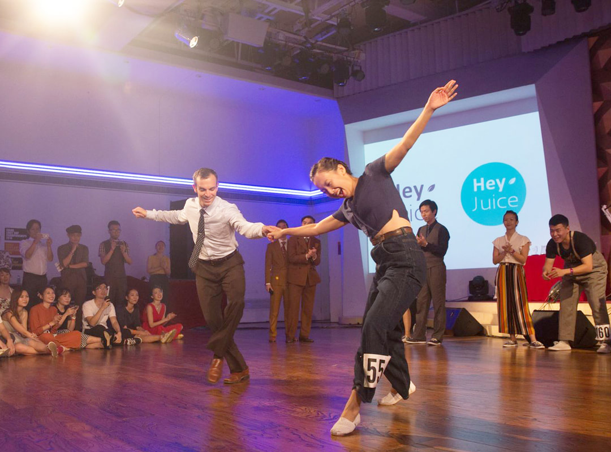

```{r setup, include=FALSE}
knitr::opts_chunk$set(echo = FALSE)
source(file.path("R", "functions.R"))
library(distilltools)
```

Welcome to my personal website! I am a researcher, engineer, choice modeler, [`r make_icon("fab fa-r-project")`](https://www.r-project.org/about.html) enthusiast, musician, swing dancer, and an Assistant Professor at George Washington University in the [Department of Engineering Management and Systems Engineering](http://emse.seas.gwu.edu/).

I study technological change, with a focus on accelerating the transition to environmentally sustainable and energy-saving technologies. My research centers around how consumer preferences, market dynamics, and policy affect the emergence of critical technologies, such as electric vehicles and solar energy. I also study the critical relationship between the US and China in developing and mass producing low-carbon energy technologies. I apply a variety of methods, including discrete choice modeling, conjoint analysis, exploratory analysis, and interview-based case studies. I speak fluent Mandarin Chinese and have conducted extensive fieldwork in China, collaborating with colleagues at Tsinghua University, Beijing Normal University, and the State Information Center on past projects. Below is a brief description of some of my passions and hobbies. You can also see more about my background on my CV and Resume:

<center>
```{r, echo=FALSE}
icon_link(
    text = "Resume",
    url  = "https://www.jhelvy.com/content/helveston-resume.pdf"
)
icon_link(
    text = "CV",
    url  = "https://www.jhelvy.com/content/helveston-cv.pdf"
)
```
</center>

# `r make_icon("fab fa-r-project")`

I use [`r make_icon("fab fa-r-project")`](https://www.r-project.org/about.html) for most of my quantitative research projects. One specific category of research is choice modeling. I use [choice-based conjoint](https://sawtoothsoftware.com/help/lighthouse-studio/manual/hid_web_whatcbc.html) surveys to measure people's preferences for a variety of technologies and policies. I have developed several packages for implementing conjoint in `r make_icon("fab fa-r-project")`, including [`{logitr}`](https://jhelvy.github.io/logitr/) for estimating multinomial and mixed logit models with preference space and "willingness-to-pay" space utility parameterizations, and [`{cbcTools}`](https://jhelvy.github.io/cbcTools/) for  designing and conducting power analyses for choice-based conjoint surveys.

In addition to choice modeling, I [teach](teaching.html) multiple programming and data analytics courses in `r make_icon("fab fa-r-project")`, and all of my course materials are built using `r make_icon("fab fa-r-project")`, including course websites and slides. I also co-authored the [`{renderthis}`](https://jhelvy.github.io/renderthis/) package with [Garrick Aden-Buie](https://www.garrickadenbuie.com/) for rendering media (e.g., [`xaringan`](https://github.com/yihui/xaringan) slides) into multiple different formats.

You can see more of my `r make_icon("fab fa-r-project")` projects and source code on my GitHub page: https://github.com/jhelvy/

# China & 中文

{width=80% .external}

I began studying Chinese during my second year as an undergraduate engineering student at Virginia Tech in the fall of 2006. The next spring, I received the Horton Scholarship, which provided a unique opportunity to travel to China and complete an educational project of my own design. I traveled to Dalian in the summer of 2008 to study language and culture at Liaoning Normal University, then I moved to Shanghai in the fall to gain international engineering experience as an intern in General Electric's Advanced Wind Turbine Operations division. The project opened my eyes to the many forces that shape the adoption of emerging technologies, in particular the importance of policy and economics. After returning to the U.S., I was awarded a [Critical Language Scholarship](http://clscholarship.org/) by the U.S. Department of State to study Chinese in Harbin, China during the summer of 2009, and I have since returned to China numerous times for work or research, including an internship at the [Innovation Center for Energy and Transportation (iCET)](http://icet.org.cn/english/index.asp) and as a 2014 [East Asia Pacific Summer Institutes (EAPSI)](http://www.nsf.gov/eapsi) Fellow supported by the U.S. National Science Foundation. Today, I continue to use my language skills and experience in China while conducting interdisciplinary research in China.

# Swing Dancing

{width=80% .external}

Many of my closest friends know me first and foremost as a dancer. In the fall of 2006, I attended my first swing dance hosted by the Virginia Tech Swing Club [Soley Swing](https://gobblerconnect.vt.edu/organization/solelyswing), and swing dancing quickly became a major part of my life. I dance Lindy Hop, Balboa, Blues, and Charleston, and my dancing adventures have brought me to cities all over the world, including New York, Montreal, Boston, Washington D.C., Hong Kong, Beijing, Shanghai, Seoul, Pusan, Osaka, Taipei, and even on the [Great Wall of China](http://www.greatwallswingout.com/). Sharing the joy of swing dancing with friends and strangers all over the world is one of my greatest passions. I have competed internationally as a dancer, and my most accomplished achievement is winning 1st place in the Open Strictly Lindy Hop competition with my good friend Annabel Truesdell Quisao at the 2011 [International Lindy Hop Championship](http://www.ilhc.com/index.php) in Washington, D.C.

# Music

{width=60% .external}

Music was my earliest passion. I grew up playing piano, violin, and mandolin, and I have had the privilege of studying and performing with some incredible musicians. In high school I had the honor of studying violins with the legendary Dora Marshall Mullins of Virginia Beach, VA, and I have played in multiple ensembles, including the [Virginia Beach Symphony Orchestra](http://www.symphonicity.org/) (now "Symphonicity"), the [New River Valley Symphony](http://www.music.vt.edu/ensembles/nrvs/) at Virginia Tech, the [National Taiwan Normal University Symphony](http://www.music.ntnu.edu.tw/orchestra/eng/), and the [All University Orchestra](http://alluniversityorchestra.org/) at Carnegie Mellon University. I am also a self-taught mandolinist and guitarist and enjoy playing jazz and bluegrass. I have fortunately had many opportunities to play with some wonderful jazz friends, including the [Muddy Basin Ramblers](http://www.muddybasin.com/) (a New Orleans-style jazz band in Taipei) and the [Hot Club of Beijing](http://www.hotclubofbeijing.com/fr_home.cfm) (a gypsy swing band based in China's capital).

Thanks for visiting my site, and I am grateful for any feedback you may have!

Cheers,

John (章乐汉)
