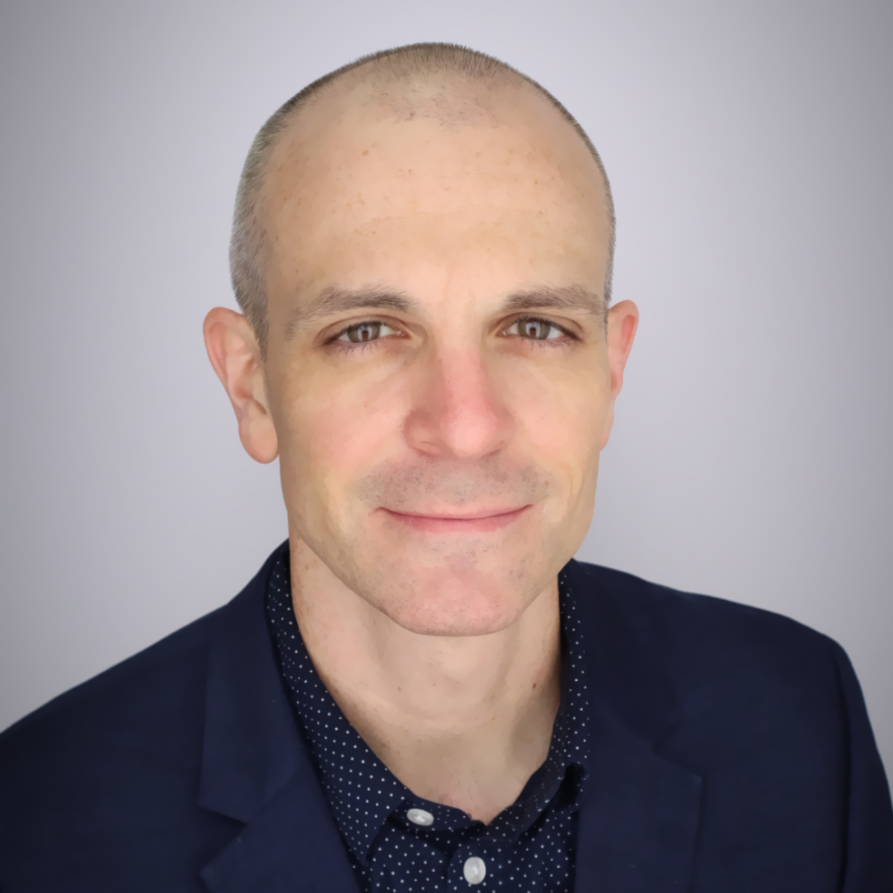
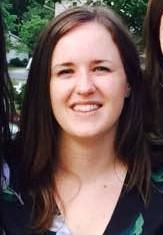
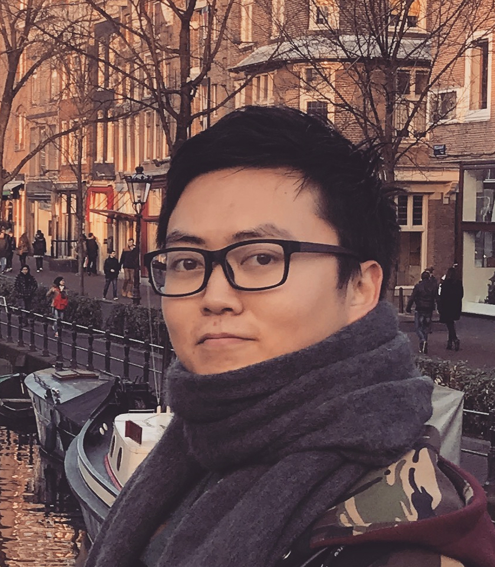
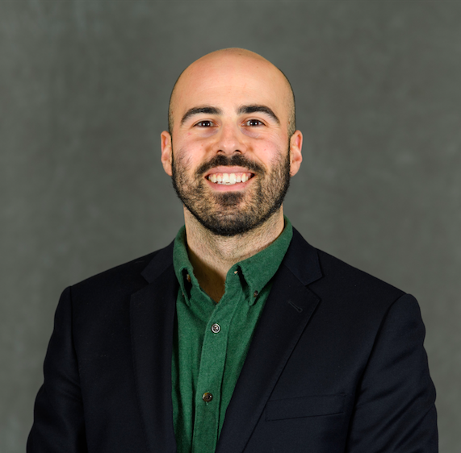
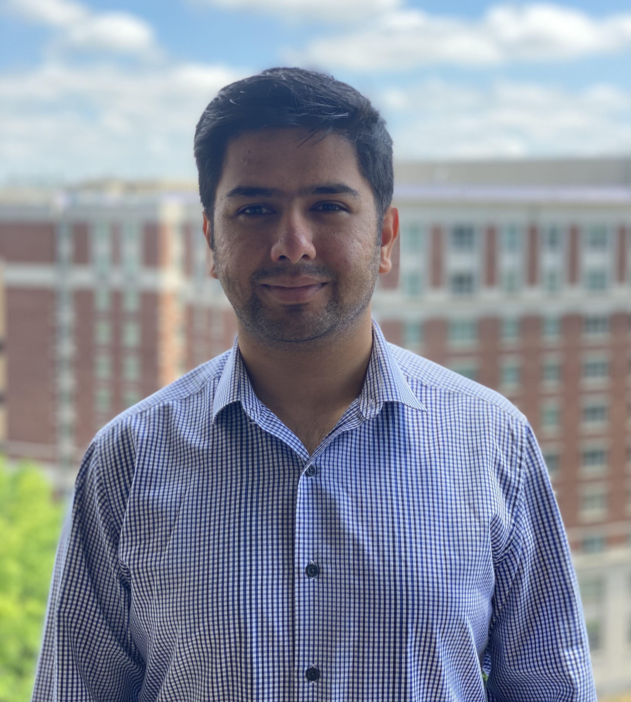
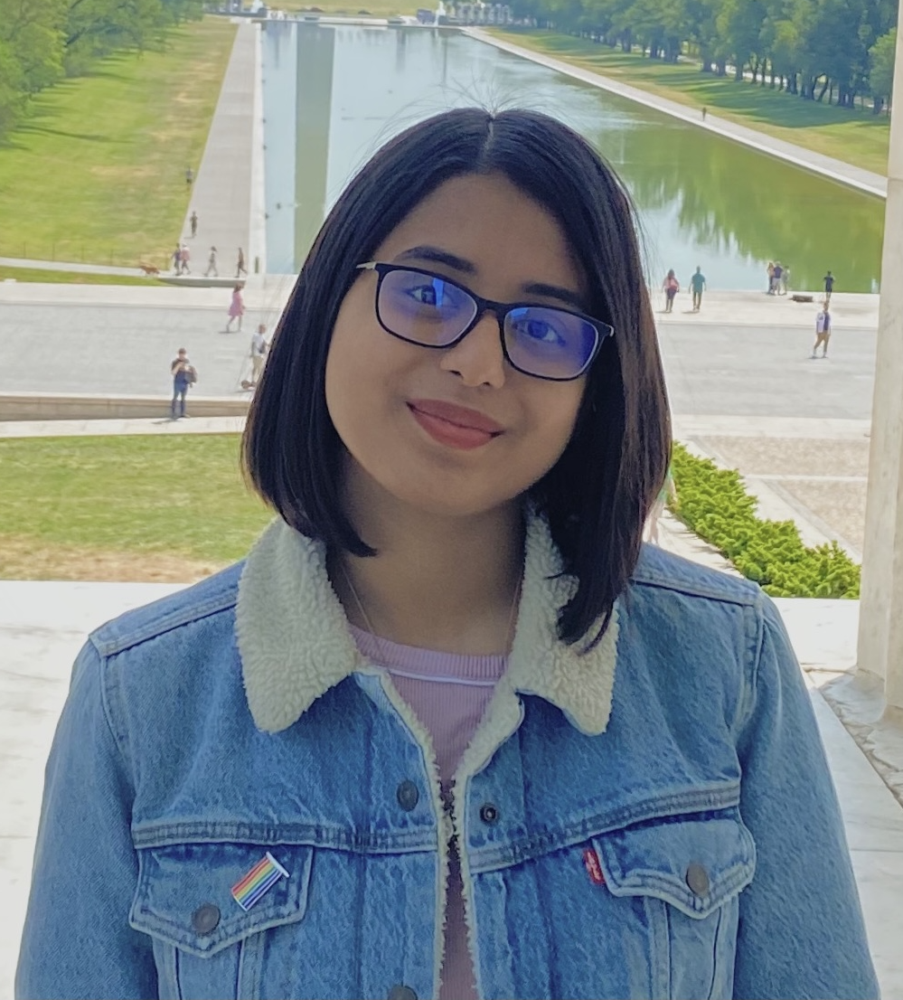
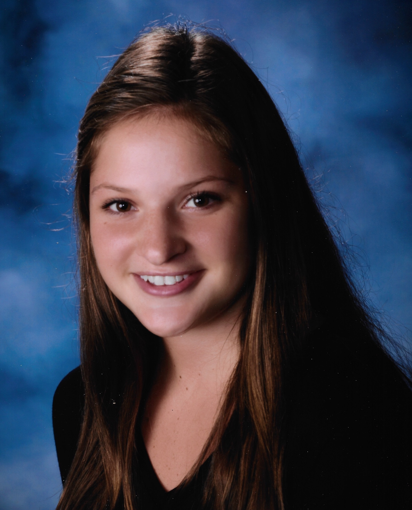
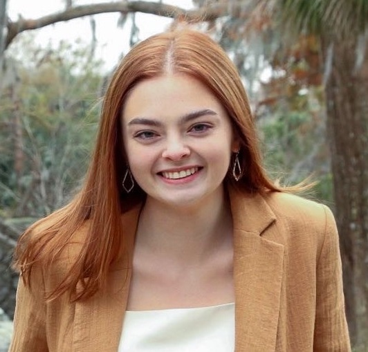

```{r setup, echo=FALSE}
knitr::opts_chunk$set(echo = FALSE)
source(file.path("R", "functions.R"))
library(distilltools)
```

# Topics

- **Technology Change**: Study how consumers, firms, markets, and policy affect the nature & pace of transitioning to new technologies.
- **Market Analytics for Decision Making**: Measure and model consumer preferences to assess policy and product design and simulate consumer choice behavior.
- **Electric Vehicles & Sustainable Transportation Technologies**: Assess barriers and opportunities to accelerate the development & adoption of sustainable transportation technologies.
- **U.S.-China Climate Relationship**: Study the critical relationship between the U.S. and China in developing and mass producing low carbon energy technologies.

# Affiliations

- [Institute for Sustainable Energy](https://www.bu.edu/ise/), Boston University
- [Vehicle Electrification Group](https://www.cmu.edu/cit/veg/), Carnegie Mellon University
- [Center for Climate and Energy Decision Making](https://cedmcenter.org/), Carnegie Mellon University
- [China Automotive Energy Research Center](http://lce.tsinghua.edu.cn/en/index.asp), Tsinghua University
- [Innovation Center for Energy and Transportation](http://www.icet.org.cn/)

# Funding

- [National Science Foundation](http://www.nsf.gov/)
- [Toyota Mobility Foundation](https://www.toyota.com/usa/community/grant-guidelines-applications/overview.html)
- [Link Energy Foundation](http://www.linkenergy.org/)
- [Ford Motor Company](http://corporate.ford.com/homepage.html)

# People

## Faculty

:::float-left



### John Paul Helveston, Ph.D.

John Paul Helveston is an Assistant Professor in the [Department of Engineering Management and Systems Engineering](https://www.emse.seas.gwu.edu/) at the [George Washington University](https://www.gwu.edu/). He studies technological change, with a particular interest in accelerating the transition to environmentally sustainable and energy-saving technologies. His research centers around how consumer preferences, market dynamics, and policy affect the emergence of critical technologies, such as electric vehicles and solar energy. He is an expert on China's rapidly emerging electric vehicle industry as well as the critical relationship between the US and China in developing and mass producing low carbon energy technologies. He applies an interdisciplinary approach to research, with expertise in discrete choice modeling and conjoint analysis as well as interview-based case studies. He has conducted extensive fieldwork in China, collaborating with colleagues at Beijing Normal University and China's State Information Center on past projects. He is a fluent speaker of Mandarin Chinese and also an award-winning swing dancer. John holds a Ph.D. and M.S. in [Engineering and Public Policy](https://www.cmu.edu/epp/) from Carnegie Mellon University and a B.S. in [Engineering Science and Mechanics](http://www.beam.vt.edu/) from Virginia Tech.

:::

## Ph.D. Students

:::float-left



### Laura Roberson

Laura is focusing her dissertation research on consumer acceptance and interaction with innovative technologies, especially in the transportation industry. Her research interests include electric vehicle adoption, innovation developments and policies that promote innovations. She also has 9+ years working for a global automotive manufacturer, giving her a balance of academic and industry knowledge and experience. Laura received her BS in Industrial and Systems Engineering from Virginia Tech and her MS in Systems Engineering from the great GWU EMSE department.

<br>


### Leah Kaplan

Leah is a National Science Foundation Graduate Research Fellow. Leah graduated summa cum laude with her Bachelor’s in chemical engineering from the University of Arizona before moving to DC to pursue an interest in science policy. Leah interned with the House Committee on Science, Space, and Technology and worked for the Arizona State University Consortium for Science, Policy & Outcomes. Leah’s primary research interest is decision-making under uncertainty related to emerging technologies, with a focus on transportation. She aims to understand how we can leverage technologies for the benefit of, rather than detriment to, society.

<br>


### Lujin Zhao (赵鲁晋)

Lujin received a B.S. in Agricultural and Resources Economics from University of Maryland, a M.S. degree in Economics from Tufts University, and a M.S. degree in Data Analytics from the George Washington University. His interests are China’s EV subsidy policies, environmental impacts from the EV industry, and energy policy. For the past several years, he has been living in the DC area and he really enjoys the summertime here except for during June, July and August.

<br>



### Pingfan Hu (胡平凡)

Pingfan received a M.P.E. degree in Mechanical Engineering from Sydney University, and a B.S. degree in Industrial Engineering from Penn State University. Prior to joining GW, Pingfan had 4 years of work experience in supply chain and engineering management. His primary research interest is the adoption of PEV smart charging, with an expansion to V2G charging. He is currently working on a study using conjoint analysis to assess people's willingness to participate in such programs.

<br>



### Michael Rossetti

Michael Rossetti is a data scientist and software engineer. He has worked as a data analyst for a winning US Presidential campaign, an analytics director for a Silicon Valley startup, and a technology consultant for the US Government. He teaches courses in data science, computer science, and software development, and conducts research in applied machine learning.

:::

## Undergraduate Students

:::float-left


### Lola Nurullaeva

Lola is an undergraduate student in Systems Engineering at The George Washington University. In Dr. Helveston's lab, she supported a project led by Ph.D. student Leah Kaplan modeling the cost to operate an autonomous vehicle taxi service.

:::

## Alumni

:::float-left



### Saurav Pantha (MS Systems Engineering, 2021)

Saurav worked with Professor Helveston as a masters student in Systems Engineering at George Washington University. Originally from Kathmandu, Nepal, he graduated with he MS degree in Systems Engineering in 2021. Before GW, he worked at a business consulting firm based out of Bangalore, India, helping multiple automotive & banking clients to solve business problems through data analytics solutions. Within Dr. Helveston's lab, he supported multiple research projects by setting up a pipeline for a MySQL database, writing R scripts to clean & wrangle data, and conducting literature surveys. In his free time, he loves to go on treks and watch Manchester United's soccer games live.

<br>


### Eliese Ottinger (BS Systems Engineering, 2023; MS Systems Engineering, 2024)

Eliese worked with Professor Helveston as both an undergraduate and masters student in Systems Engineering at George Washington University. She graduated with her Bachelors degree in Systems Engineering in 2023 with minors in Sustainability and Mathematics, and will graduate with her MS degree in 2024. In Dr. Helveston's lab, she analyzed differences in how people drive gas vehicles and electric vehicles and is an author on a [resulting publication](https://www.sciencedirect.com/science/article/abs/pii/S254243512300404X).

<br>



### Kazi Asifa Ashrafi (BS Systems Engineering, 2022)

Kazi worked with Professor Helveston as a sophomore undergraduate student in Systems Engineering at George Washington University. Originally from Bangladesh, she graduated with her Bachelors degree in Systems Engineering in 2022 with a minor in Statistics. She has always been enthusiastic about advocating for social causes and was previously involved in research projects at Penn State that aimed to enhance skills of preschoolers in the area of social-emotional development. She recently interned at a non-profit focusing on issues surrounding diaspora communities in regards to climate change. In Dr. Helveston's lab, she explored the geo-spatial distribution of electric vehicles (EVs) across the U.S.

<br>



### Helena Rowe (BS Systems Engineering, 2022)

Helena worked with Professor Helveston as a sophomore undergraduate student in Systems Engineering at George Washington University. Originally from Marblehead, Massachusetts, she graduated with her Bachelors degree in Systems Engineering in 2022 with a minor in Sustainability. In previous roles, she has worked for a small consulting firm, analyzed market research for a building materials start-up, and researched with a professor about climate change risks in the investment industry. Within Dr. Helveston's lab, she worked on electric vehicle (EV) sales forecasting over time from different organizations.

<br>



### Amelia Jacquat (BS Systems Engineering, 2023)

Amelia worked with Professor Helveston as a sophomore undergraduate student in Systems Engineering at George Washington University. Originally from New Orleans, LA, she graduated with her Bachelors degree in Systems Engineering in 2023 with minors in Computer Science and Theatre. Within Dr. Helveston's lab, she worked on electric vehicle (EV) sales forecasting over time from different organizations.

:::

## Opportunities

### Current Opportunities

I am currently seeking a Ph.D. student to join my lab starting in the Fall 2023 semester. Learn more [here](https://github.com/jhelvy/jhelvy_distill/raw/master/opportunities/phd.pdf). 

### Ph.D. Students

I am always happy to hear from motivated potential students who are considering a Ph.D. through the [Engineering Management & Systems Engineering Department](https://www.emse.seas.gwu.edu/) at GWU. If you are interested in working with me as your advisor, please send me an email with the following attachments:

- Your CV.
- A written statement describing specific research topics you are interested in and why (at least one page).
- A summary of your prior research experience and skills.

### Graduate Research Assistants

Although currently I am not seeking a GRA for ongoing research projects, there is a good chance that I may have opportunities in the near future. If you are a masters student and would like to gain some research experience in my lab, please send me an email with the following information:

- Your CV.
- A brief statement of your research interests.
- A brief summary of your prior research experience and skills.

Candidates with the following skills / experience are particularly encouraged: webscraping, data cleaning, exploratory data analysis, life cycle assessment, simulation.

### Undergraduate Research Assistants

If you are an undergraduate student and would like to gain some research experience in my lab, don't hesitate to send me an email. I frequently have specific research tasks that make for great undergraduate research projects. If you are interested, please send me an email with the following information:

- Your CV.
- A brief statement describing specific research topics you are interested in and why.

### Visitors

I am happy to welcome visiting scholars and students to my lab. Although I do not have funding at the moment to sponsor visitors, I would be happy to host you if you can be funded by your own institutions or other sources. Please email me your CV and research plan for further discussions.
