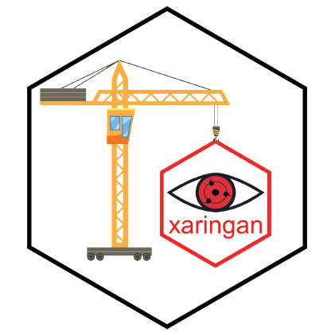
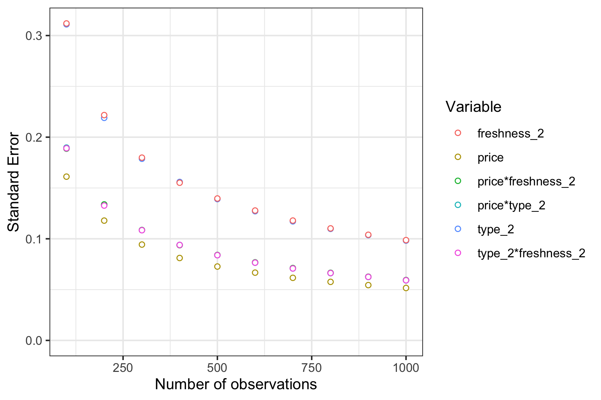
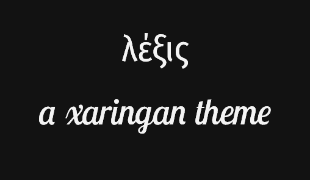

```{r setup, echo=FALSE}
knitr::opts_chunk$set(echo = FALSE)
source(file.path("R", "functions.R"))
```

```{r, layout="l-body-outset"}
htmltools::HTML(
'<div class="masonry-wrapper"><div class="masonry">
  <div class="masonry-item">
    <div class="masonry-content">
      <a href="https://jhelvy.github.io/logitr/" class="card-hover">
      </a>
      <h3 class="masonry-title">Nesciunt aspernatur eaque similique laudantium a</h3>
      <p class="masonry-description">Lorem ipsum dolor sit amet, consectetur adipisicing elit. Assumenda modi inventore, totam vero consequuntur, aut animi veritatis tempora nulla facere placeat velit illum explicabo dicta enim ipsum. Vitae ducimus, ratione.</p>
    </div>
  </div>
  <div class="masonry-item">
    <div class="masonry-content">
      
      <h3 class="masonry-title">Consequatur adipisci neque possimus quod ut quidem omnis numquam dolorum</h3>
      <p class="masonry-description">Consectetur adipisicing elit. Sit enim ipsam mollitia repellat nemo, accusantium? Fugit id ipsam libero vitae quas perferendis, delectus a amet perspiciatis iusto. Quia, quam, culpa.</p>
    </div>
  </div>
  <div class="masonry-item">
    <div class="masonry-content">
      
      <h3 class="masonry-title">Adipisci alias ullam est accusamus</h3>
      <p class="masonry-description">Adipisci repellendus ratione laudantium nisi eaque voluptatem fuga quod hic, explicabo amet at laborum maiores ducimus et a vel quidem dolorem modi.</p>
    </div>
  </div>
  <div class="masonry-item">
    <div class="masonry-content">
      
      <h3 class="masonry-title">Dolor sit amet, consectetur adipisicing elit</h3>
      <p class="masonry-description">Vitae est numquam, dolore, ipsum tempora molestiae. Ut optio natus velit eaque tempora commodi dolor doloremque error quidem labore, incidunt odit est nobis numquam. Ullam quas minima, neque modi reiciendis consequuntur inventore!</p>
    </div>
  </div>
  <div class="masonry-item">
    <div class="masonry-content">
      
      <h3 class="masonry-title">Veritatis aut repellendus, quidem nesciunt consequatur nulla sed itaque</h3>
      <p class="masonry-description">Expedita voluptate similique ad harum dolorem nam ipsa repellat quos, autem eius magni minima, asperiores nobis repudiandae ut quibusdam atque! Delectus atque veniam labore suscipit ullam, consequuntur dicta, tenetur est nulla, quod obcaecati similique?</p>
    </div>
  </div>
</div>
</div>
'
)
```
