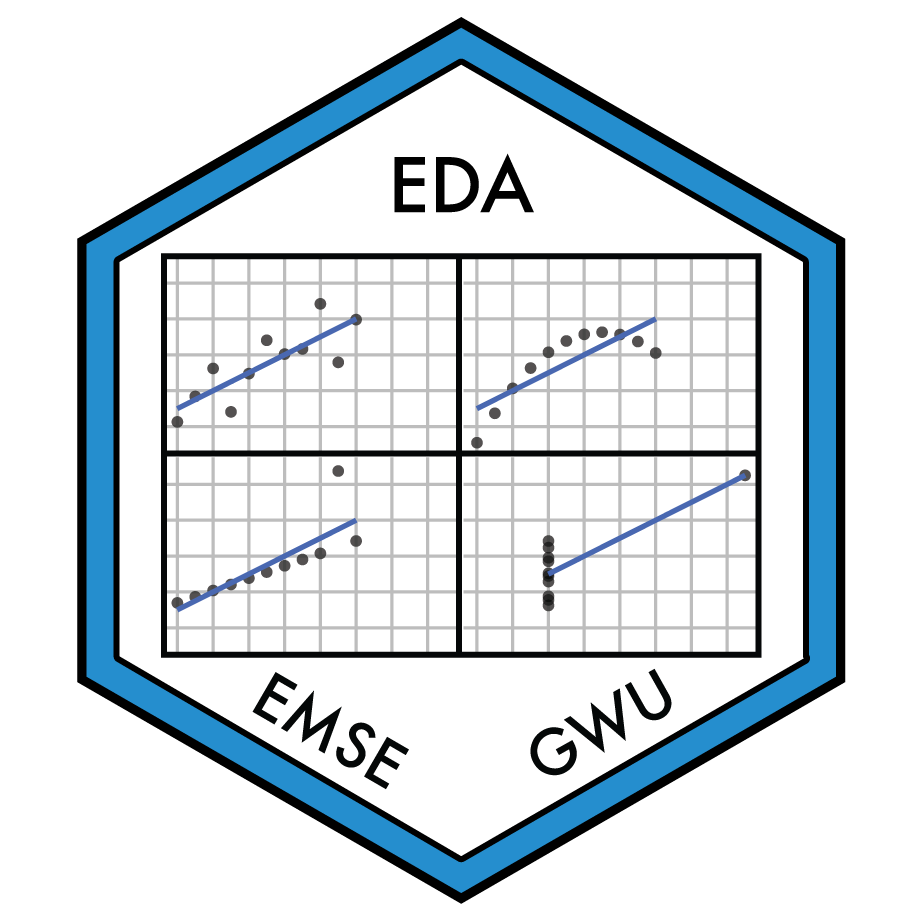

```{r setup, echo=FALSE}
knitr::opts_chunk$set(echo = FALSE)
```

:::float-left


### [EMSE 4571: Programming for Analytics](https://p4a.seas.gwu.edu/)

This course provides a foundation in programming for analytics using the [R programming language](https://www.r-project.org/) with a comparison to [Python](https://www.python.org/). Topics covered include fundamentals of programming (operators, data types, objects, functions, conditionals, loops, strings, testing, and debugging) as well as techniques for working with data sets in R and Python (file input/output, data structures, data wrangling, data visualization, external packages, and reproducible reporting). Emphasis will be on producing clear, robust, and reasonably efficient code using top-down design, informal analysis, and effective testing and debugging. Students will primarily work on individual programming assignments to develop skills in computational problem solving, writing code, and working with data. Students will be assessed through quizzes, homework assignments, and exams. Teaching will involve interactive lectures with plenty of time spent live coding and working on practice problems in class. This course assumes no prior programming experience and is an ideal preparation for higher level courses in data analytics.

:::

<aside>

**Semesters Taught**:

- [Spring 2023](https://p4a.seas.gwu.edu/2023-Spring/)
- [Spring 2022](https://p4a.seas.gwu.edu/2022-Spring/)
- [Fall 2020](https://p4a.seas.gwu.edu/2020-Fall/)
- [Fall 2019](https://p4a.seas.gwu.edu/2019-Fall/)

</aside>

<br>

:::float-left



### [EMSE 4572: Exploratory Data Analysis](https://eda.seas.gwu.edu/)

This course provides students with a foundation in exploring data using the [R programming language](https://www.r-project.org/). Students will learn how to source, manage, transform, and explore a wide variety of data types. Students will also master the fundamental concepts for visualizing and communicating information contained in raw data, including the human psychology of visual information processing. All analyses will be conducted to support reproducibility from raw data to results using [RMarkdown](https://bookdown.org/yihui/rmarkdown/). Teaching will involve interactive lectures with plenty of class time spent working on examples and coding. Students will be assessed through in-class quizzes, reading reflections, and exploratory projects. Throughout the semester, students will work on a research project of their own design to demonstrate mastery of the course's topics. At the end of the semester, students will submit a final, reproducible report of their project along with a 10-minute video presentation of their findings.

:::

<aside>

**Semesters Taught**:

- [Fall 2022](https://eda.seas.gwu.edu/2022-Fall/)
- [Spring 2021](https://eda.seas.gwu.edu/2021-Spring/)
- [Spring 2020](https://eda.seas.gwu.edu/2020-Spring/)

</aside>

<br>

:::float-left


### [EMSE 6035: Marketing of Technology](https://madd.seas.gwu.edu/)

This course provides students with data analysis techniques to inform design decisions in an uncertain, competitive market; topics include consumer choice modeling, programming in the [R programming language](https://www.r-project.org/), survey design, conjoint analysis, optimization, market simulation, and professional communication skills. Over the course of the semester, students will learn and apply theory and methods to a team project to assess the market competitiveness of an emerging product / technology and use marketing analytics to generate design insights. At the end of the semester, students will submit a final, reproducible report of their project along with a 10-minute presentation of their findings. This course has a "flipped" classroom structure. Students will spend the majority of class time working through guiding practice exercises or working on their projects. To prepare for class, students must complete weekly assignments that involve watching and reviewing recorded lecture materials and answering related practice questions.

:::

<aside>

**Semesters Taught**:

- [Fall 2022](https://madd.seas.gwu.edu/2022-Fall/)
- [Fall 2021](https://madd.seas.gwu.edu/2021-Fall/)
- Spring 2019

</aside>

<br>

:::float-left


### [R for Analytics Primer](https://jhelvy.github.io/r4aPrimer/)

A self-guided tutorial for developing a foundation in programming in R for data analysis, including data input/output, data wrangling, and data visualization using the [Tidyverse](https://www.tidyverse.org/).

:::
